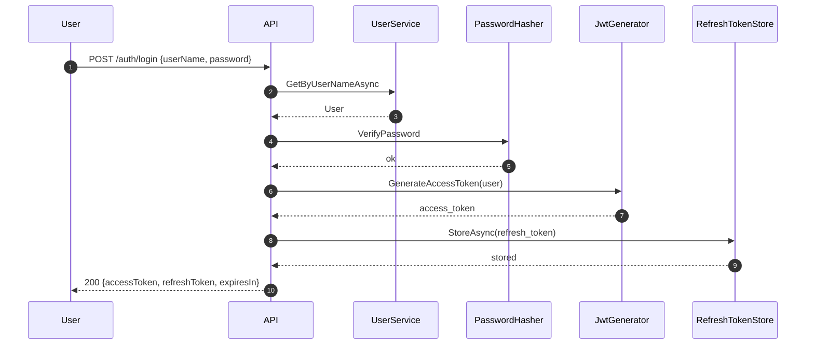
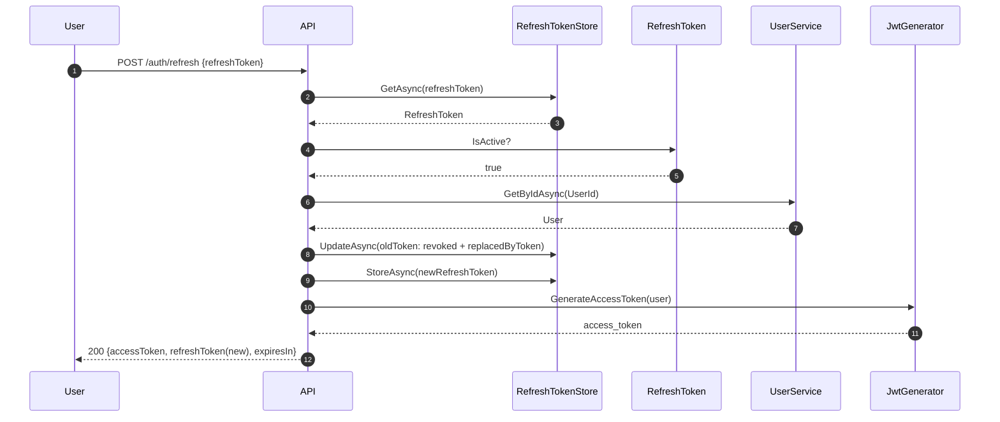

# C# OAuth2 + Refresh Token Mini API  
### .NET 8 Authentication — JWT Access Token + Refresh Token Rotation + PBKDF2 Hashing + Rate Limiting + Clean Architecture

> Bu proje, API sistemlerinde kullanılan JWT access token + refresh token rotation mekanizmasını baştan sona gösteren bir mini örnektir.

---

## 🚀 Özellikler

- **.NET 8 Web API**
- **JWT access token (short-lived)**
- **Refresh token (long-lived) + Rotation**
- **Token revoke chain** (reuse tespiti & engelleme)
- **PBKDF2 password hashing**
- **InMemory refresh token store** (Redis-ready mimari)
- **IP-based rate limiting (5 req/min)**
- **Clean Architecture: Api / Application / Domain / Infrastructure**
- **xUnit + FluentAssertions testleri**
- **Mermaid sequence diagram’lı dokümantasyon**

---

## 📁 Proje Yapısı

dotnet-oauth2-refresh-token-api/ <br>
│ <br>
├── src/ <br>
│ ├── Auth.Api/ → Web API (Controllers, Middleware, DI) <br>
│ ├── Auth.Application/ → Login & Refresh use-case’leri <br>
│ ├── Auth.Domain/ → Entities (User, RefreshToken) <br>
│ └── Auth.Infrastructure/ → JWT, Hashing, TokenStore, UserStore <br>
│ <br>
└── tests/ <br>
├── Auth.Application.Tests/ <br>
└── Auth.Api.Tests/ <br>

## 🔐 Mimari Özet

| Katman | Sorumluluk |
|--------|------------|
| **Domain** | User & RefreshToken modelleri, business rules |
| **Application** | AuthService (login, refresh, rotation) |
| **Infrastructure** | Hashing, JWT üretimi, token store, user store |
| **Api** | Controller, rate limiting, DI, authentication middleware |

## 🔄 Token Akışları (Mermaid)

### **Login Flow**


### **Refresh Flow (Rotation)**



## ⚙️ Kurulum
### 1. Depoyu klonla
```
git clone https://github.com/<username>/dotnet-oauth2-refresh-token-api.git
cd dotnet-oauth2-refresh-token-api
```

### 2. Bağımlılıkları yükle
```
dotnet restore
dotnet build
```
### 3. API’yi çalıştır
```
dotnet run --project src/Auth.Api/Auth.Api.csproj
```

## 🧪 Örnek İstekler
### Login
```
POST /auth/login
Content-Type: application/json

{
  "userName": "testuser",
  "password": "Password123!"
}
```

### Refresh Token
```
POST /auth/refresh
Content-Type: application/json

{
  "refreshToken": "<REFRESH_TOKEN>"
}

```
## 🛡️ Rate Limiting
Yalnızca login ve refresh endpoint’lerinde aktif:

IP başına 1 dakikada 5 istek

Limit aşılırsa:

```
429 Too Many Requests
```
Bu brute-force saldırılarına karşı kritik savunmadır.

## 🔒 Güvenlik Detayları
### ✔ PBKDF2 Hashing

100.000 iterations <br>
16-byte salt <br>
32-byte key <br>
Constant-time comparison <br>

### ✔ Refresh Token Rotation

Her refresh çağrısında yeni refresh token üretilir. <br>
Eski token revoke edilir. (artık geçersiz) <br>
ReplacedByToken alanı zincir oluşturur. <br>

### ✔ Access Token (JWT)
HMAC-SHA256 <br>
sub, unique_name, jti claim’leri <br>
Ömür: 5 dakika <br>


